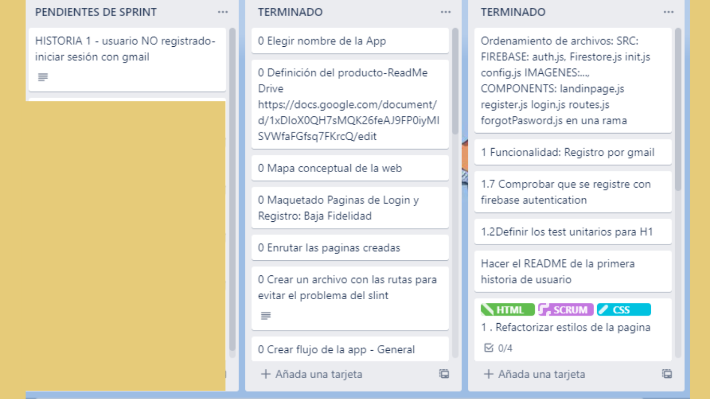
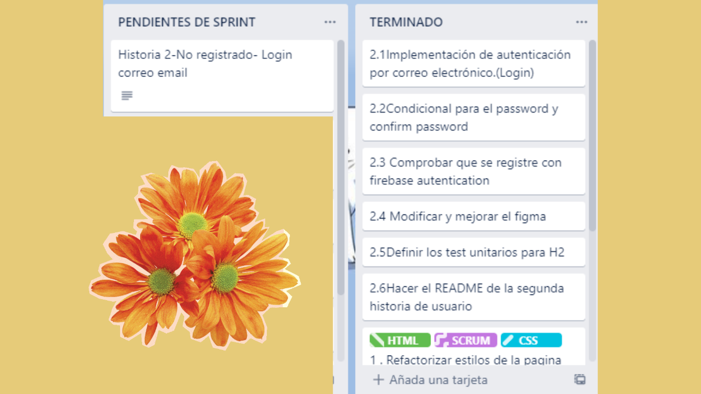

# Creando una Red Social

# Red Social

Ducky Pets
## Índice
* [1. Definición del producto](#1-Definición-del-producto)
* [2. Historias de usuario](#2-Historias-de-usuario)
* [3. Diseño de la Interfaz de Usuario](#3-Diseño-de-la-Interfaz-de-Usuario)
* [4. Pruebas Unitarias](#4-Pruebas-Unitarias)
### 1. Definición del producto
 Ducky Pets es una red social de intercambio de contenido con multimedia exclusivo para mascotas.
* #### Identificación de las principales necesidades de los usuarios
  Primero identificamos los tipos de [redes sociales](https://blog.hootsuite.com/es/8-tipos-de-redes-sociales/) sociales existentes, conversamos de cosas que teniamos en común, amamos a los animales, y decidimos orientarnos a ello. También observamos que en plataformas como instagram, los usuarios usan sus perfiles para colocar las fotos de sus mascotas e incluso crean perfiles para ellos. Considerando todo ello decidimos desarrollar esta app exclusiva para mascotas, permitiendo a los usuarios una busqueda e información más especifica orientada a las mascotas.
* #### Principales usuarios del producto
 -Todos los Dueños de las mascotas.
 -Todos los amantes de las mascotas.
* #### Qué problema resuelve el producto
  Ya que es una plataforma exclusivamente para mascotas, permite al usuario mantener la individualidad de su perfil.
  Ya que muchos amantes de sus mascotas, tienen más fotos de ellas que de sí mismas. Le permite tener más orden, ya que cuando desee una información relevante para el cuidado de su mascota o usar alguna foto de ella, lo podrá encontrar rápidamente.

* #### Para qué le servirá a estos usuarios.
- Compartir información del cuidado de mascotas.
 - Compartir la ternura de nuestras mascotas.
 - Compartir experiencias similares de nuestras mascotas.
 - Encontrarse con gente de intereses similares.
 - Encontrar contenido específico de mascotas.
### 2. Historias de usuario
Trabajamos el proyecto mediante las siguientes historias de usuario, haciendo uso de [Trello](https://trello.com/invite/b/n8GPm7qR/ecaeff9b3c34b8dbc2ed03404000b468/ducky-pets).
#### HU01 - Usuario NO registrado-Login con gmail

#### HU02 - Usuario NO registrado-Login con Email and Password

#### HU03 - Estructuración de Home

### 3. Diseño de la Interfaz de Usuario
#### Diseño en baja fidelidad
Primera historia de usuario

Segunda historia de usuario

#### Diseño en alta fidelidad
El prototipo de alta fidelidad lo podemos encontrar [aquí](https://dev-to-uploads.s3.amazonaws.com/uploads/articles/th5xamgrr6se0x5ro4g6.png)

### 4. Pruebas Unitarias

#### Mocks- 01HU-Archivos: Auth.js Register.js Login.js

#### Mocks - 02HU-Archivos: _______ _______ ________

### Authors

- [@NayTrevejo](https://github.com/Sharksumi/LIM017-social-network.git)
- [@Valentina](https://github.com/minifemtovalen/LIM017-social-network.git)
- [@JammieHurtado](https://github.com/Emmigumi/LIM017-social-network.git)

